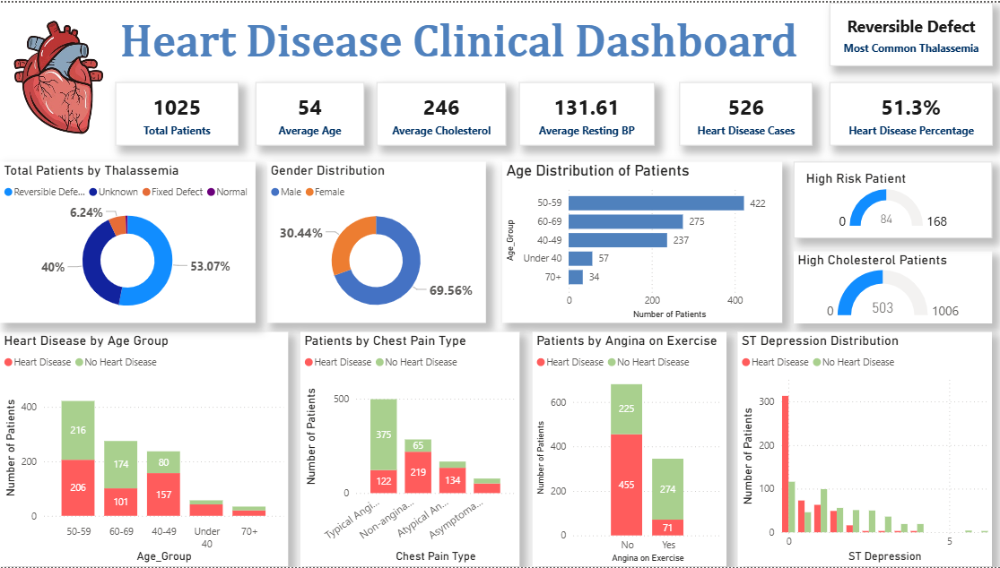

# ❤️ Heart Disease Clinical Dashboard

A Power BI dashboard to analyze heart disease trends using clinical data.



---

## 📊 Key Insights

- **Total Patients:** 1,025
- **Heart Disease Cases:** 526
- **Heart Disease Prevalence:** 51.3%
- **Average Age:** 54
- **Average Cholesterol:** 246
- **Average Resting BP:** 131.61

---

## 📌 Visualizations & Highlights

### Demographics
- **Gender Distribution**: 69.56% Male, 30.44% Female
- **Age Groups**: Most patients fall between 50–59 years
- **Thalassemia**:
  - Most common: *Reversible Defect* (53.07%)
  - Other types include Unknown (6.24%), Fixed Defect, and Normal

### Clinical Indicators
- **High Cholesterol Patients**: 503 with `chol > 240`
- **High-Risk Patients**: Based on combined clinical features
- **Angina on Exercise**: Majority of heart disease cases report angina

### Risk Group Analysis
- **Heart Disease by Age Group**: Prevalence increases with age
- **Chest Pain Type Correlation**:
  - Typical and Asymptomatic pain types are highly associated with heart disease
- **ST Depression Distribution**:
  - Lower ST depression more common in heart disease patients

---

## ⚙️ Tools Used

- **Power BI**: Data modeling, measures (DAX), and dashboarding
- **DAX**: Custom measures such as:
  ```dax
  Total Patients = COUNTROWS('heart')
  Heart Disease Cases = CALCULATE(COUNTROWS('heart'), 'heart'[target] = 1)
  High_Cholesterol_Patients = CALCULATE(COUNTROWS('heart'), 'heart'[chol] > 240)
  ```

---

## 📁 Dataset

This dashboard is based on a public heart disease dataset. The features include:
- Age, Sex, Chest Pain Type
- Blood Pressure, Cholesterol, Fasting Blood Sugar
- ECG Results, Max Heart Rate, Exercise-Induced Angina
- ST Depression, ST Slope, Major Vessels, Thalassemia
- Target (Heart Disease Presence)

---

## 🧠 Purpose

To help clinicians and health analysts:
- Identify high-risk heart disease profiles
- Visualize key patterns in cardiac health data
- Make informed decisions using data-driven insights
